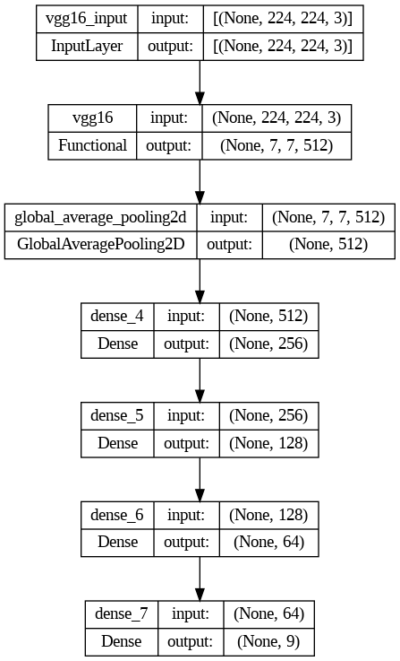

# Multiclass Skin Disease Classification using CNN

Skin diseases come in various forms and can significantly impact an individual's overall health and well-being. Accurate diagnosis is crucial, as some skin disorders, such as various types of skin cancer, can be life-threatening. Dermatologists often face challenges in categorizing and diagnosing skin conditions accurately, which is why cutting-edge technologies like deep learning algorithms are being explored to enhance dermatological diagnostics. This project aims to build a Convolutional Neural Network (CNN) model that can classify nine different types of skin diseases with over 70% precision.

## Data
The classifier has been trained using International Skin Imaging Collaboration (ISIC) Skin Cancer dataset: [data](data_cnn) which contains 2357 images of malignant and benign oncological diseases with nine categories of pigmented skin lesions/skin diseases.

## Model Architecture

The CNN model architecture above is designed to handle the multiclass classification of the 9 skin diseases in our data. It incorporates convolutional layers for feature extraction and dense layers for classification. The model's performance metrics and validation results are discussed in the "Results" section.

## How to Run the App
### Method 1
•Run the [script](skincondition.py) file

•Go to [app URL]() on your browser

•Use the Choose button to browse and upload the image you want

•Hit Predict to get the results.

### Method 2
•Deploy it to Azure Webapp or Heroku App through github repository

•Go to url generated after deployment on your browser

•Use the Choose button to browse and upload the image you want

•Hit Predict to get the results.

## Libraries used
• numpy

• keras

• tensorflow-cpu==2.5.0

• pandas

• matplotlib

• pillow

• streamlit

• seaborn

##  Multi_Class_Image_Classification_Project_Final.ipynb
This is the Notebook used to define and train the model: [Final Notebook]()

## Application
This is the streamlit app that needs to run in order to use the webapp: [App](skincondition.py)

## FInal saved model name
Contains the weights of the best model: [Best model]()

## CNN Model Summary
* Image of the final model's summary
  
## Results
* This section will present the tabular rep of the performance metrics of the CNN model, including precision, recall, and accuracy

## Conclusion
* summarize the achievements, the model's potential impact on dermatological diagnostics, and potential areas for future research and improvement.
  
